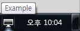
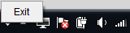
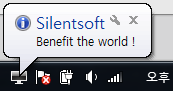

Java에서 기본적으로 제공하는 SystemTray 클래스를 이용하면 아이콘을 등록거나,
  
메뉴를 등록하거나, 메세지를 띄우는건 의외로 간단하다.

```
void java.awt.SystemTray.add(TrayIcon trayIcon) throws AWTException
```

SystemTray.add() 메소드는 시스템 트레이에 트레이 아이콘을 등록해주는 메소드이다. 이 메소드를 사용해서 트레이 아이콘을 추가해보도록 하자.

우선, 한번 만들고 범용적으로 쓸 수 있도록 TrayIconHandler 클래스를 만들고,
  
아래와 같이 trayIcon 선언과 registerTrayIcon() 메소드를 작성하자.

```
private static TrayIcon trayIcon;

public static void registerTrayIcon(Image image, String toolTip, ActionListener action) {
	if (SystemTray.isSupported()) {
		if (trayIcon != null) {
			trayIcon = null;
		}
		trayIcon = new TrayIcon(image);
		trayIcon.setImageAutoSize(true);

		if (toolTip != null) {
			trayIcon.setToolTip(toolTip);
		}

		if (action != null) {
			trayIcon.addActionListener(action);
		}

		try {
			for (TrayIcon registeredTrayIcon : SystemTray.getSystemTray()
					.getTrayIcons()) {
				SystemTray.getSystemTray().remove(registeredTrayIcon);
			}

			SystemTray.getSystemTray().add(trayIcon);
		} catch (AWTException e) {
			LOGGER.error("I got catch an error during add system tray !", e);
		}
	} else {
		LOGGER.error("System tray is not supported !");
	}
}
```
[Parameters]
- image : 시스템 트레이에 등록될 아이콘 이미지. 
- toolTip : 아이콘에 마우스를 올렸을 때 보여질 메세지.
- action : 아이콘을 더블 클릭했을 때 실행 할 행동을 정의한 ActionListener.

사용 예는 아래와 같다.

```
public static void main(String[] args) {
	TrayIconHandler.registerTrayIcon(
		Toolkit.getDefaultToolkit().getImage("src/main/resources/icon/computer.png"),
		"Example",
		new ActionListener() {
			@Override
			public void actionPerformed(ActionEvent e) {
				System.exit(0);
			}
		}
	);
}
```

src/main/resources/icon 폴더 밑에 computer.png 아이콘 파일을 넘겨주고, 마우스로 올려질 때 보여질 "Example", 그리고 더블 클릭했을 때 종료되는 코드이다.



이제 오른쪽 클릭했을 때 보여질 아이템을 추가하고, 아이템에 대한 액션을 정의해보자.

getPopupMenu(), add(), isRegistered(), isNotRegistered(), addItem() 총 4개의 메소드를 TrayIconHandler 클래스에 아래와 같이 정의한다.

```
private static PopupMenu getPopupMenu() {
	PopupMenu popupMenu = trayIcon.getPopupMenu();

	if (popupMenu == null) {
		popupMenu = new PopupMenu();
	}

	return popupMenu;
}

private static void add(MenuItem item) {
	if (isNotRegistered()) {
		return;
	}

	PopupMenu popupMenu = getPopupMenu();
	popupMenu.add(item);

	trayIcon.setPopupMenu(popupMenu);
}

public static boolean isRegistered() {
	return (trayIcon != null && getPopupMenu() != null) ? true : false;
}

public static boolean isNotRegistered() {
	return !isRegistered();
}

public static void addItem(String label, ActionListener action) {
	MenuItem menuItem = new MenuItem(label);
	menuItem.addActionListener(action);

	add(menuItem);
}
```

그리고 아래와 같이 addItem() 메소드를 호출하자.

```
public static void main(String[] args) {
	TrayIconHandler.registerTrayIcon(
		Toolkit.getDefaultToolkit().getImage("src/main/resources/icon/computer.png"),
		"Example",
		new ActionListener() {
			@Override
			public void actionPerformed(ActionEvent e) {
				// Open your application here.
			}
		}
	);
	TrayIconHandler.addItem("Exit", new ActionListener() {
		@Override
		public void actionPerformed(ActionEvent e) {
			System.exit(0);
		}
	});
}
```

앞서 더블 클릭했을 때 수행하던 프로그램 종료 코드를 삭제하고, Exit 아이템을 클릭했을 때 종료하도록 변경했다.



트레이 아이콘 근처에 팝업 메세지를 띄우는 것도 가능하다.

아래와 같이 displayMessage() 메소드를 TrayIconHandler 클래스에 정의하자.

```
public static void displayMessage(String caption, String text, MessageType messageType) {
	if (isNotRegistered()) {
		return;
	}
	
	trayIcon.displayMessage(caption, text, messageType);
}
```

프로그램이 시작될 때 팝업 메세지를 보여주도록 displayMessage() 메소드를 호출하자.

```
public static void main(String[] args) {
	TrayIconHandler.registerTrayIcon(
		Toolkit.getDefaultToolkit().getImage("src/main/resources/icon/computer.png"),
		"Example",
		new ActionListener() {
			@Override
			public void actionPerformed(ActionEvent e) {
				// Open your application here.
			}
		}
	);
	TrayIconHandler.addItem("Exit", new ActionListener() {
		@Override
		public void actionPerformed(ActionEvent e) {
			System.exit(0);
		}
	});

	TrayIconHandler.displayMessage("Silentsoft", "Benefit the world !", MessageType.INFO);
}
```

이제 프로그램이 시작될 때 팝업 메세지가 보여진다.



MessageType은 INFO 이외에도 WARNING, ERROR, NONE을 사용할 수 있다.

**TrayIconHandler.java**
```
package org.silentsoft.core.tray;

import java.awt.AWTException;
import java.awt.CheckboxMenuItem;
import java.awt.Image;
import java.awt.Menu;
import java.awt.MenuItem;
import java.awt.PopupMenu;
import java.awt.SystemTray;
import java.awt.TrayIcon;
import java.awt.TrayIcon.MessageType;
import java.awt.event.ActionListener;
import java.awt.event.ItemListener;

import org.slf4j.Logger;
import org.slf4j.LoggerFactory;

public final class TrayIconHandler {

	private static Logger LOGGER = LoggerFactory
			.getLogger(TrayIconHandler.class);

	private static TrayIcon trayIcon;

	private static PopupMenu getPopupMenu() {
		PopupMenu popupMenu = trayIcon.getPopupMenu();

		if (popupMenu == null) {
			popupMenu = new PopupMenu();
		}

		return popupMenu;
	}

	private static void add(MenuItem item) {
		if (isNotRegistered()) {
			return;
		}

		PopupMenu popupMenu = getPopupMenu();
		popupMenu.add(item);

		trayIcon.setPopupMenu(popupMenu);
	}

	private static void addToMenu(String menu, MenuItem item) {
		if (isNotRegistered()) {
			return;
		}

		if (isNotExistsMenu(menu)) {
			addMenu(menu);
		}

		for (int i = 0, j = getPopupMenu().getItemCount(); i < j; i++) {
			if (getPopupMenu().getItem(i) instanceof Menu) {
				Menu menuitem = (Menu) getPopupMenu().getItem(i);
				if (menuitem.getLabel().equals(menu)) {
					menuitem.add(item);

					getPopupMenu().insert(menuitem, i);

					break;
				}
			}
		}
	}

	public static boolean isRegistered() {
		return (trayIcon != null && getPopupMenu() != null) ? true : false;
	}

	public static boolean isNotRegistered() {
		return !isRegistered();
	}

	public static boolean isExistsMenu(String menu) {
		if (isNotRegistered()) {
			return false;
		}

		for (int i = 0, j = getPopupMenu().getItemCount(); i < j; i++) {
			if (getPopupMenu().getItem(i) instanceof Menu) {
				Menu item = (Menu) getPopupMenu().getItem(i);
				if (item.getLabel().equals(menu)) {
					return true;
				}
			}
		}

		return false;
	}

	public static boolean isNotExistsMenu(String menu) {
		return !isExistsMenu(menu);
	}

	public static void registerTrayIcon(Image image) {
		registerTrayIcon(image, null, null);
	}

	public static void registerTrayIcon(Image image, String toolTip) {
		registerTrayIcon(image, toolTip, null);
	}

	public static void registerTrayIcon(Image image, String toolTip,
			ActionListener action) {
		if (SystemTray.isSupported()) {
			if (trayIcon != null) {
				trayIcon = null;
			}

			trayIcon = new TrayIcon(image);
			trayIcon.setImageAutoSize(true);

			if (toolTip != null) {
				trayIcon.setToolTip(toolTip);
			}

			if (action != null) {
				trayIcon.addActionListener(action);
			}

			try {
				for (TrayIcon registeredTrayIcon : SystemTray.getSystemTray()
						.getTrayIcons()) {
					SystemTray.getSystemTray().remove(registeredTrayIcon);
				}

				SystemTray.getSystemTray().add(trayIcon);
			} catch (AWTException e) {
				LOGGER.error("I got catch an error during add system tray !", e);
			}
		} else {
			LOGGER.error("System tray is not supported !");
		}
	}

	public static void setToolTip(String toolTip) {
		if (isNotRegistered()) {
			return;
		}

		trayIcon.setToolTip(toolTip);
	}

	public static void setImage(Image image) {
		if (isNotRegistered()) {
			return;
		}

		trayIcon.setImage(image);
	}

	public static void displayMessage(String caption, String text,
			MessageType messageType) {
		if (isNotRegistered()) {
			return;
		}

		trayIcon.displayMessage(caption, text, messageType);
	}

	public static void addSeparator() {
		if (isNotRegistered()) {
			return;
		}

		getPopupMenu().addSeparator();
	}

	public static void addSeparator(String menu) {
		if (isNotRegistered()) {
			return;
		}

		for (int i = 0, j = getPopupMenu().getItemCount(); i < j; i++) {
			if (getPopupMenu().getItem(i) instanceof Menu) {
				Menu item = (Menu) getPopupMenu().getItem(i);
				if (item.getLabel().equals(menu)) {
					item.addSeparator();

					getPopupMenu().insert(item, i);

					break;
				}
			}
		}
	}

	public static void addMenu(String menu) {
		add(new Menu(menu));
	}

	public static void addItem(String label, ActionListener action) {
		MenuItem menuItem = new MenuItem(label);
		menuItem.addActionListener(action);

		add(menuItem);
	}

	public static void addCheckBox(String label, ItemListener action) {
		addCheckBox(label, false, action);
	}

	public static void addCheckBox(String label, boolean state,
			ItemListener action) {
		CheckboxMenuItem checkboxMenuItem = new CheckboxMenuItem(label, state);
		checkboxMenuItem.addItemListener(action);

		add(checkboxMenuItem);
	}

	public static void addItemToMenu(String menu, String label,
			ActionListener action) {
		MenuItem menuItem = new MenuItem(label);
		menuItem.addActionListener(action);

		addToMenu(menu, menuItem);
	}

	public static void addCheckBoxToMenu(String menu, String label,
			ItemListener action) {
		addCheckBoxToMenu(menu, label, false, action);
	}

	public static void addCheckBoxToMenu(String menu, String label,
			boolean state, ItemListener action) {
		CheckboxMenuItem checkboxMenuItem = new CheckboxMenuItem(label, state);
		checkboxMenuItem.addItemListener(action);

		addToMenu(menu, checkboxMenuItem);
	}
}
```

포스트에는 소개하지 않았지만, 위 TrayIconHandler 클래스에 구분선 추가, 메뉴 추가, 메뉴 안에 메뉴 혹은 아이템 추가, 체크박스를 추가할 수 있도록 구현해 놓았다.

코드가 너무 간단해서 별도의 주석은 없다.
