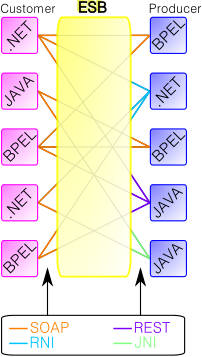

ESB란 Enterprise Service Bus의 약자로, 서비스들을 컴포넌트화된 논리적 집합으로 묶는 핵심 미들웨어이며, 비즈니스 프로세스 환경에 맞게 설계 및 전개할 수 있는 아키텍처 패턴이다.

> 이원화된 환경에서 Customer 클라이언트와 Producer 서버간에 SOAP, REST, RNI, JNI를 이용하여 프로세스를 수행한다.

ESB의 통신 근간은 WSDL(Web Service Description Language, 이하 웹 서비스)를 통해 이루어진다. 웹 서비스란 서비스 제공 장소, 서비스 메세지 포맷, 프로토콜 등을 XML로 기술하는데, 쉽게 말해서 웹 서비스를 호출하면 클라이언트의 언어와 서버의 언어에 관계없이 비즈니스 프로세스를 수행할 수 있다고 보면 된다.

웹 서비스를 하기 위해서는 적절한 전송 프로토콜을 선택해야 한다. 실무에서는 SOAP이 거의 지배적인데, 요즘 트렌드는 REST인 것 같다. 어디까지나 언어/환경/비즈니스에 따라 무엇을 선택하느냐는 각자 다르기에, 꼭 어떤 프로토콜이 정답이고 최선이라고 정의내리기는 힘들다.

무슨 전송 프로토콜을 선택하느냐는 옵션이고, 핵심은 End Point이다.
  
End Point란, 해당 웹 서비스의 실제 비즈니스를 수행하기 위하여 연결하는 연결고리인데, 이것을 바인딩해야 Customer 클라이언트에서 웹 서비스 호출이 가능하다.

(~~최근에 ESB를 접할 때만 해도 사람들이 'ESB로 태워서 보내야 한다.'라고 표현을 하기에, 나는 ESB가 그냥 전사에서 사용하는 어떤 제품 혹은 솔루션 이름인 줄 알았다. 그래서 ESB를 통해 어떤 프로세스를 수행하기 위해서 전사에서 제공하는 가이드 문서를 보고 한참을 삽질하고 있었는데, 모양새를 보아하니 제품이나 솔루션은 아닌 것 같고, 전반적으로 산업분야에서 공통적으로 쓰일 수 있겠다 생각이 들어 검색을 해보니, ESB는 아키텍처 패턴중에 하나라고 하더라..~~)

요약하자면,
  
ESB란 이원화된 환경에서 비즈니스를 수행하기 위하여 사용하는 아키텍처 패턴이다.
  
(~~'ESB를 사용한다'고 해서 ESB를 제품 이름이나 솔루션 이름으로 오해하지는 말자.~~)

참조 글 :
- [wikipedia (엔터프라이즈 서비스 버스)](https://ko.wikipedia.org/wiki/%EC%97%94%ED%84%B0%ED%94%84%EB%9D%BC%EC%9D%B4%EC%A6%88_%EC%84%9C%EB%B9%84%EC%8A%A4_%EB%B2%84%EC%8A%A4)
- [wikipedia (WSDL)](https://ko.wikipedia.org/wiki/WSDL)
