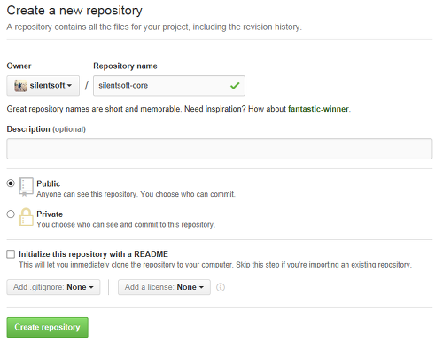
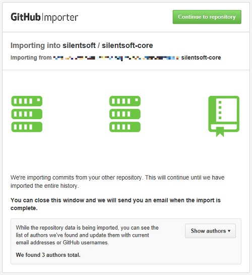

요즘 소스 형상 관리 추세는 svn보다는 확실히 git인 것 같다.
  
혼자서 svn으로 잘 개발하고 있었는데, git으로 가는 데는 2가지 이유가 있다.

첫째.

소스 오픈의 매력이다. svn으로 소스를 오픈하려면 내 서버의 주소와 계정을 알려야 하는 번거로움이 있었다. 만약 내 서버의 도메인이 바뀌거나 계정이 바뀌는 경우 좀 귀찮아지는데, git으로 넘어가면서 이 문제는 자연스레 해결.

둘째.

내 서버의 하드 고장으로 소스 분실의 걱정이 필요가 없어졌다.

(당연한 얘기지만 서버 관리는 나보다 github가 더 잘해줄테니..)
  
(그래도 혹시 모르니까 서버는 백업용으로 사용해야겠다.)

이외에도 여러가지 장/단점이 있으나, 이 글에서는 생략.

아래 3가지 절차를 진행하면 쉽게 svn에서 git으로 이전할 수 있다.

1. github 회원가입
  
2. github repository 생성
  
3. import code

회원가입은 생략하고

> git repository는 public과 private 정책으로 나뉜다. 소스를 비공개하고 싶을 경우 비용을 지불하고 private 정책을 사용해야한다.

repository 생성 화면에서 이름을 설정한 뒤 'Create repository' 버튼을 누르면

'... or import code from another repository' 옵션이 있는데, 이 옵션이 svn에서 git으로 이전을 도와주는 옵션이다.

이렇게 import가 끝나면, svn의 history를 온전히 git으로 이전할 수 있다.

놀고 있는 svn 서버 두고 private 정책 쓰기엔 비용 낭비인 것 같으니 당분간 개발 중인 프로젝트는 svn으로 개발하고 마무리할 때 public repo에 import 해야겠다.
