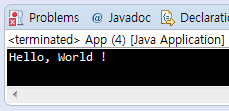

운영 시스템에서 System.out으로 로그를 남기는 경우는 없다고 봐도 무방하다.
  
또, 'Logging은 절대 System.out으로 하면 안 된다'고 생각하는 사람이 많다.
  
그런데 아이러니하게도 그 이유를 모르는 사람들도 많다.

오늘은 그 이유에 대해서 얘기해 볼까 한다.

이 포스팅은 1인 개발자이면서, Logging을 System.out으로 하는 사람들에게도 한 번쯤 읽어볼 만한 소재가 될 수 있겠다.

먼저 로깅의 사전적 정의를 살펴보면 아래와 같다.

> **로깅 [logging]**
>
> 시스템을 작동할 때 시스템의 작동 상태의 기록과 보존, 이용자의 습성 조사 및 시스템 동작의 분석 등을 하기 위해 작동중의 각종 정보를 기록해둘 필요가 있다. 이 기록을 만드는 것을 로깅이라 한다. 즉 로그 시스템의 사용에 관계된 일련의 「사건」을 시간의 경과에 따라 기록하는 것이다.
>
> \[네이버 지식백과\] [로깅 \[logging\]](http://terms.naver.com/entry.nhn?docId=827902) (컴퓨터인터넷IT용어대사전, 2011. 1. 20., 일진사)

자바를 처음 배울 때 아래 코드를 타이핑 해본 경험이 있을 테다.

```
System.out.println("Hello, World !");
```

그리고 출력되는 콘솔 창의 결과도 아래와 같이 보았을 테다.



그런데, 뭔가 없다. 많이 없다. 그러니까, 필요한 최소한의 정보가 없다.
  
여기서 얘기하는 '최소한의 정보'란, 날짜/시간/로그 생성자/타입(error, info, debug..) 등을 얘기한다. 이 정보들은 별거 아닌 것 같지만, 분석을 위한 기초가 되면서 사실 굉장히 중요한 정보들이다.

필자가 자바에서 애용하는 로깅 라이브러리는 slf4j-log4j인데,  이 라이브러리를 사용해서 로그를 남기면 아래와 같이 남게 된다.


이미지를 보면 알 수 있듯이, 위에서 언급한 최소한의 정보를 포함하고 있다.
  
또, 몇 가지 설정을 통해서 로그를 파일로 남길 수도 있다. 이렇게 남는 로그 파일은 에러나 장애 발생 시 아주 유용한 정보원이 된다.
  
(사용 방법이나 설정 방법은 이 포스팅의 주요 주제가 아니므로 생략한다.)

그러니까, Logging을 System.out으로 하면 안 되는 이유를 말하자면 이렇다.

- 에러/장애 발생 시 추적할 수 있는 최소한의 정보가 없다.
- 최소한의 정보는 고사하고, 로그 내용을 가져오기 어렵다.
- 누가 봐도 System.out.println은 콘솔에 로그를 출력하는 API이다.

오해의 소지가 있을 것 같아 위 3가지를 조금만 더 얘기하겠다.

첫 번째, 최소한의 정보가 없지만 만들어 줄 수는 있다. 물론 수동으로.

두 번째, 로그 내용을 어떻게 가져오거나 서버로 전송할까? 이미 콘솔에 뿌려진걸..

세 번째, 애초에 콘솔 말고 파일로 출력하게 할 수도 있다. 하지만 누가 상상이나 할까..

단순히 로깅을 떠나서 프로그램은 혼자 만들고 땡이 아니므로, 협업하는 개발자/운영자를 위해서 System.out은 지양하고 로깅 라이브러리를 사용해야 할 필요가 있겠다.
