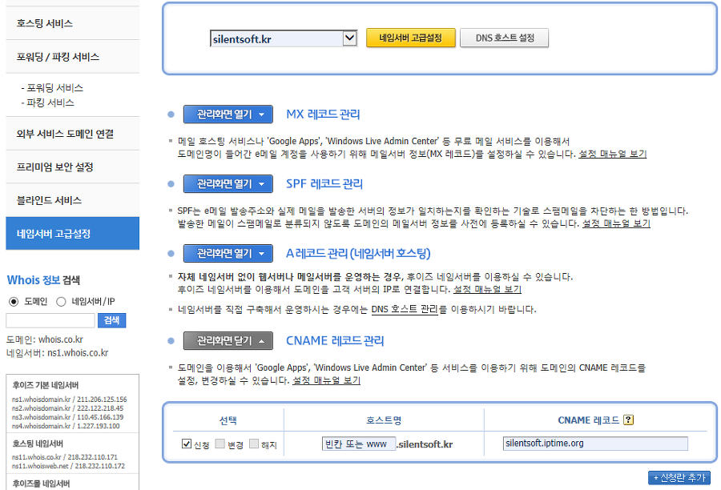

최근에 개인적으로 반응형 웹 사이트를 제작해야 할 일이 생겨서 부트스트랩을 시작했다.

개발한 웹에 로컬에서 IP 기반으로 다이렉트로 접속하는 경우 PC, 안드로이드, 아이폰에서 아무 문제가 없었으나, 도메인을 포워딩하여 접속하는 경우 특이하게 아이폰에서만 손가락으로 확대/축소가 안된다거나 js/css가 먹통이 된다거나하는 문제가 발생했다. 이를 해결하기 위해서는 먼저 도메인 포워딩 방식을 이해해야 할 필요가 있다.

도메인 포워딩 방식에는 아래와 같이 유동 포워딩과 고정 포워딩 2가지로 나뉘어진다.

> **유동 포워딩**
>
> 웹 브라우저 주소창에 도메인 명이 유지되지 않고 사이트로 연결되는 방식
>
> **고정 포워딩**
>
> 프레임 방식으로 웹 브라우저 주소창에 도메인 명이 그대로 유지된 채 사이트에 연결되는 방식

필자가 애용하는 도메인 관리 사이트는 후이즈인데, 포워딩 서비스 관리 화면을 보면 아래와 같이 두 개의 선택지가 있다.

첫 번째 옵션("주소창에 포워딩 URL 표시")이 유동 포워딩 방식이고, 두 번째 옵션("주소창에 도메인명 유지")이 고정 포워딩 방식이다. 친절하게 노란 박스에 프레임 방식이라 정상적으로 표시되지 않거나 불안정할 수 있다고 안내해준다.

유동 포워딩으로 바꾸면 해결은 되지만, 주소창에 원사이트의 URL이 그대로 표시되는 문제가 발생한다. 이를 해결하려면 포워딩 서비스를 해지하고 CNAME 레코드로 연결 주소를 설정하면 된다.

도메인 레코드 설정은 각 도메인 관리 사이트에서 제공하고 있다. 후이즈의 경우 아래와 같이 네임서버 고급설정 페이지에서 설정할 수 있다.

필자는 iptime 공유기를 사용하기 때문에 iptime ddns를 설정하고, CNAME을 iptime의 ddns로 연결했다.

포워딩 서비스와는 다르게 레코드 관련 정보를 신청/변경하는 경우 다소 시간이 걸린다. 후이즈에서는 최장 48시간 내에는 반영이 된다고 안내되어 있지만 실제로 그렇게 오래 걸리지는 않는다.

반영이 되었는지 안되었는지 확인하는 방법은 cmd 커맨드 "nslookup xxxx.iptime.org"의 결과와 "nslookup 도메인"의 결과가 같으면 반영이 된 것이다. 이때, "nslookup 도메인"의 결과에는 Aliases가 보인다.
