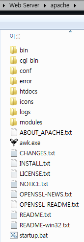

필자는 설치형 패키지는 될 수 있으면 피하는 편이다. 설치형 패키지는 서버를 밀어야 하는 상황에서 굉장히 골머리를 앓게한다. 환경 설정을 백업해야 하고, 전/후처리는 또 .. 생각만 해도 깜깜하다. 게다가 이런 류의 삽질을 많이 했기 때문에 .zip 형태의 구성을 선호한다. 만약의 상황에 쉽게 대처하기 위한 일종의 보험이다. 단, DB와 같이 데이터는 다른 곳에 보관할 수 있고, 언제든지 export/import를 쉽게 할 수 있는 프로그램은 설치형 패키지를 사용하기도 한다.

이러한 연유로 하여 Apache는 최신 버전인 2.4가 아닌 2.2 버전을 설치할 것이다.

Apache 2.2 버전에서는 .msi 설치 파일을 제공하는데, 이 파일을 설치하지 않고 UniExtract 프로그램을 통해 .msi 파일에서 설치 파일들을 추출할 것이다. (Apache 2.4 버전은 .msi 설치 파일을 제공하지 않는다.)

지금 글을 쓰는 시점에서 Apache 2.2의 마지막 버전은 httpd-2.2.25-win32-x86-openssl-0.9.8y 이다. (x64는 없다.)

아래 Link를 통해 .msi 설치 파일을 다운로드 하자.
  
[Archives](https://archive.apache.org/dist/httpd/binaries/win32/) | [Direct Link](https://archive.apache.org/dist/httpd/binaries/win32/httpd-2.2.25-win32-x86-openssl-0.9.8y.msi)

.msi 파일에서 설치될 파일들을 추출하는 UniExtract를 다운로드 하자.
  
[Archives](http://www.legroom.net/files/software/archive/archive.php) | [Direct Link](http://www.legroom.net/files/software/archive/uniextract161_noinst.rar)

UniExtract를 통해 설치될 파일들을 추출하는 방법은 간단하다. 다운받은 uniextract161_noinst.rar 압축 파일을 해제하고 실행한 뒤, .msi 파일을 지정하고 OK &#8211; MSI Administrative Installer 옵션을 통해 추출하면 된다.

추출이 완료되면 /httpd-2.2.25-win32-x86-openssl-0.9.8y/program files/Apache Software Foundation/Apache2.2/ 경로에 추출된다. 추출된 Apache2.2 폴더에는 include, lib, manual 폴더가 있는데, 이 폴더들을 지워서 조금 더 가볍게 만들자.

Apache를 구성하기 위해서는 awk 또는 gwak 툴을 이용해야 한다.
  
[Archives](http://gnuwin32.sourceforge.net/packages/gawk.htm) | [Direct Link](http://gnuwin32.sourceforge.net/downlinks/gawk-bin-zip.php)
  
위 링크로 다운받은 gwak.zip 압축 파일을 해제하고, "awk.exe" 파일만 Apache 최상위 폴더에 복사하자.

이제 아래와 같이 .bat 스크립트를 작성하자.

```
@ECHO OFF
REM Set the Apache variables (they must be outside of the IF statement)
SET SCRIPT=conf\original\installwinconf.awk
SET DOMAINNAME=localhost
SET SERVERNAME=localhost
SET SERVERADMIN=email@localhost
SET SERVERPORT=80
SET SERVERSSLPORT=443
SET SERVERROOT="%CD%"
SET SOURCEROOT=conf/original/
REM If the configuration is not done, config it!
IF EXIST conf\original\installwinconf.awk (
REM Create the required folders
MKDIR logs
MKDIR conf\extra
REM Create the configuration files
awk -f %SCRIPT% %DOMAINNAME% %SERVERNAME% %SERVERADMIN% %SERVERPORT% %SERVERSSLPORT% %SERVERROOT% %SOURCEROOT%
)
ECHO Starting Apache HTTPD...
START "WINDOWS TITLE" CMD /C bin\httpd.exe
```

위 스크립트에서 수정해야 할 곳은 아래와 같이 2곳이다.

`SET SERVERADMIN=email@localhost` 이 부분에 본인 이메일을 작성하고,
  
`START "WINDOWS TITLE" CMD /C bin\httpd.exe` 이 부분에 윈도우 타이틀에 표시할 이름을 바꿔준다.

이 스크립트를 Apache 최상위 폴더에 "startup.bat"로 저장하고 실행하면 된다.



이 startup.bat 파일은 최초에 한번만 Apache를 구성하고, 이후에는 그냥 실행만 해주는 역할을 한다.

Apache 서버를 실행하면 아무것도 표시되지 않는데, 아직 설정할게 많으므로 최초에 구성되고 실행된 Apache 서버를 종료하자.

Apache 폴더안에 conf 폴더에 존재하는 httpd.conf 파일을 열어서 아래 4개 라인에 대해 주석을 해제하자.

```
LoadModule proxy_module modules/mod_proxy.so
LoadModule proxy_connect_module modules/mod_proxy_connect.so
LoadModule proxy_http_module modules/mod_proxy_http.so
LoadModule rewrite_module modules/mod_rewrite.so
```

mod_proxy* 관련 모듈은 6편에서 Tomcat에 proxy-pass하기 위해 사용할 모듈이고, mod_rewirte 모듈은 WordPress에서 사용할 모듈이다.

6편을 참조하지 않을 독자 혹은 WordPress를 사용하다가 에러나서 신나게 구글링을 하고 싶은 독자들은 굳이 주석을 해제하지 않아도 되겠다. (필자가 사기치려는게 아니라 다 독자들의 정신 건강을 지켜주기 위함임을 알아줬으면 좋겠다.)

3편에서는 PHP를 설치하는 방법에 대하여 다루겠다.

참조 글 :
- [Run Apache HTTP on Windows without Installing](http://www.josephspurrier.com/run-apache-http-on-windows-without-installing/)
