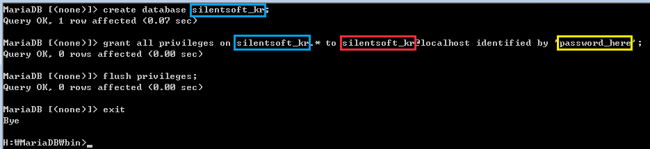

MariaDB는 MySQL과 동일한 소스 코드를 기반으로 하며, GPL v2 라이센스를 따른다. Oracle 소유의 현재 불확실한 MySQL의 라이센스 상태에 반발하여 만들어졌다.
  
(출처 - https://ko.wikipedia.org/wiki/MariaDB)

동일한 소스 코드를 기반으로 하기때문에 MariaDB를 설치하지 않고 MySQL을 설치해도 상관없다. 필자는 MySQL 대신 MariaDB를 사용하여 진행하도록 하겠다.

[Archives](https://downloads.mariadb.org/mariadb/) | [Direct Link (x86)](https://downloads.mariadb.org/f/mariadb-10.1.17/win32-packages/mariadb-10.1.17-win32.msi/from/http%3A//ftp.kaist.ac.kr/mariadb/?serve) | [Direct Link (x64)](https://downloads.mariadb.org/f/mariadb-10.1.17/winx64-packages/mariadb-10.1.17-winx64.msi/from/http%3A//ftp.kaist.ac.kr/mariadb/?serve)

2편에서 언급했듯이 필자는 DB와 같은 복잡한 프로그램은 zip 형태의 구성보다는 설치형 패키지를 선호한다. (어차피 DB 데이터 백업/복구는 확실하게 지원하니, 그냥 설치형 패키지를 이용하는게 정신 건강에 훨씬 이롭겠다.)

설치 과정은 Next 버튼만 잘 누르면 설치되므로 따로 설치 과정에 대한 언급은 하지 않겠다. 당연한 얘기지만, 설치 과정에서 root 계정에 설정한 패스워드는 꼭 기억하도록 하자.

설치가 완료되었다면, cmd를 실행하고 아래와 같이 root 계정으로 접속하자.


WordPress에서 사용할 database와 user를 생성해야 한다. 아래는 database와 user를 'silentsoft_kr'로 생성하는 예이다.



파란 박스는 database 이름이고, 빨간 박스는 user 이름이다. 노란 박스의 'password_here'은 비밀번호이므로, 진짜로 'password_here'로 설정하는 일은 없도록 하자.

```
create database silentsoft_kr;
grant all privileges on silentsoft_kr.* to silentsoft_kr@localhost identified by 'password_here';
flush privileges;
exit
```

5편에서는 WordPress를 설치하는 방법에 대하여 다루겠다.
