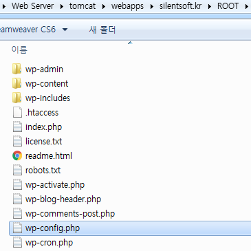

다운로드한 wordpress zip 파일을 {tomcat}/webapps/silentsoft.kr/ROOT/ 디렉터리에 풀리도록 하자. 만약, Tomcat이 아닌 Apache를 사용하는 경우, {apache}/htdocs/ 디렉터리에 풀리도록 하자. (주의 : 압축 해제할 때 /ROOT/ 디렉터리 또는 /htdocs/ 디렉터리 밑에 index.php 파일이 존재하도록 해야 한다.)

/wp-config-sample.php 파일을 열어서 DB\_NAME, DB\_USER, DB_PASSWORD를 설정한대로 수정하자.

```
define('DB_NAME', 'silentsoft_kr');
define('DB_USER', 'silentsoft_kr');
define('DB_PASSWORD', 'password_here');
```

스크롤 조금만 내려보면 아래와 같이 기본 정의된 인증키가 있다.

```
define('AUTH_KEY',         'put your unique phrase here');
define('SECURE_AUTH_KEY',  'put your unique phrase here');
define('LOGGED_IN_KEY',    'put your unique phrase here');
define('NONCE_KEY',        'put your unique phrase here');
define('AUTH_SALT',        'put your unique phrase here');
define('SECURE_AUTH_SALT', 'put your unique phrase here');
define('LOGGED_IN_SALT',   'put your unique phrase here');
define('NONCE_SALT',       'put your unique phrase here');
```

https://api.wordpress.org/secret-key/1.1/salt/ 이곳에 접속하여 나오는 값을 그대로 복사해서 기본 정의된 값을 바꾸자.

인증키 아래에는 데이터베이스에 WordPress 테이블을 만들 때 테이블명에 prefix를 정의하는 설정이 있다.

```
$table_prefix  = 'wp_';
```

기본 설정은 'wp_'인데, 취향에 맞게 바꿔도 그만, 안바꿔도 그만이다. 어차피 DB 털리면 테이블명 알아내는것은 쿼리 한 줄로 알아낼 수 있다. 테이블명이 wp_로 시작하는게 불편하다던가, 본인이 즐겨 사용했던 prefix가 있다면 이 기회에 활용하도록 하자.

테이블 prefix 설정 아래에는 DEBUG 모드를 사용할거냐에 대한 옵션이 있는데, 기본 정의된 값은 아래와 같이 false이다.

```
define('WP_DEBUG', false);
```

어차피 WordPress 구성하고 한 번 이상의 에러는 분명히 마주하게 되어있다. 그러니 처음부터 이 값을 true로 바꾸고, 'WP_DEBUG_LOG'와 'WP_DEBUG_DISPLAY' 값을 아래와 같이 추가하자.

```
define('WP_DEBUG', true);
define('WP_DEBUG_LOG', true);
define('WP_DEBUG_DISPLAY', false);
```

이렇게 설정하면 에러가 났을 때 화면에 표시되지는 않고, wp-content 폴더 아래 debug.log 파일에 기록된다. 화면에도 보여주고 싶다면, 'WP_DEBUG_DISPLAY' 값을 true로 바꾸면 된다. 하지만, 필자는 별로 추천하고 싶지 않다. 에러 로그를 사용자한테 보여줘봤자 무의미하고, 만약 에러 내용에 중요한 정보를 포함하기라도 한다면... 상상에 맡기겠다.

이제 wp-config-sample.php 파일을 저장하고, 이름을 wp-config.php로 변경하자.



이로써 WordPress에 대한 설정이 끝났다. 웹 사이트에 접근하면 설치 화면이 나오는데, 안내에 따라 진행하면 되겠다.

1편에서 언급한대로 Tomcat이 없거나 백지 상태에서 WordPress를 설치한 독자라면, 6편을 보지 않고 이대로 WordPress를 즐기면 되겠다.

6편에서는 Apache에서 Proxy를 통해 특정 사이트에 대한 요청은 Tomcat으로 패스하는 방법에 대하여 다루겠다.
