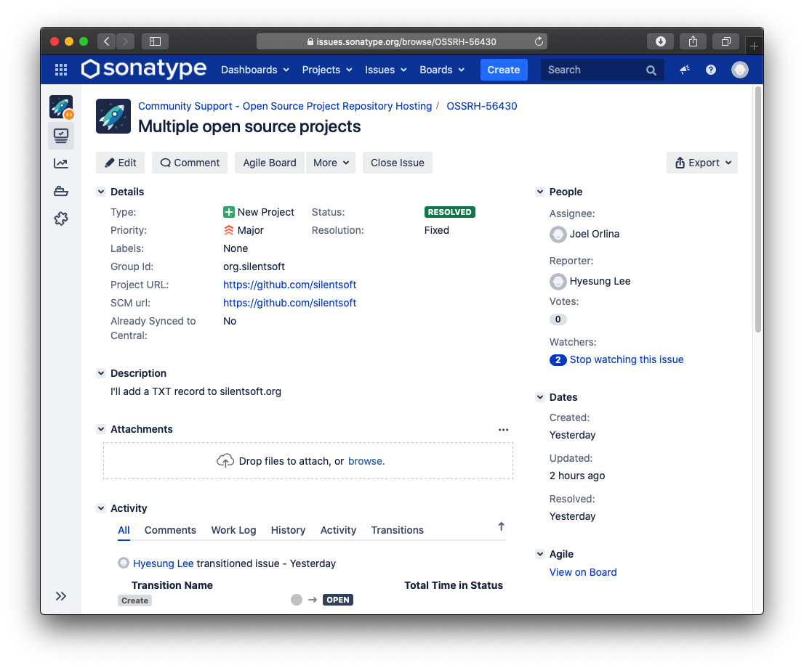
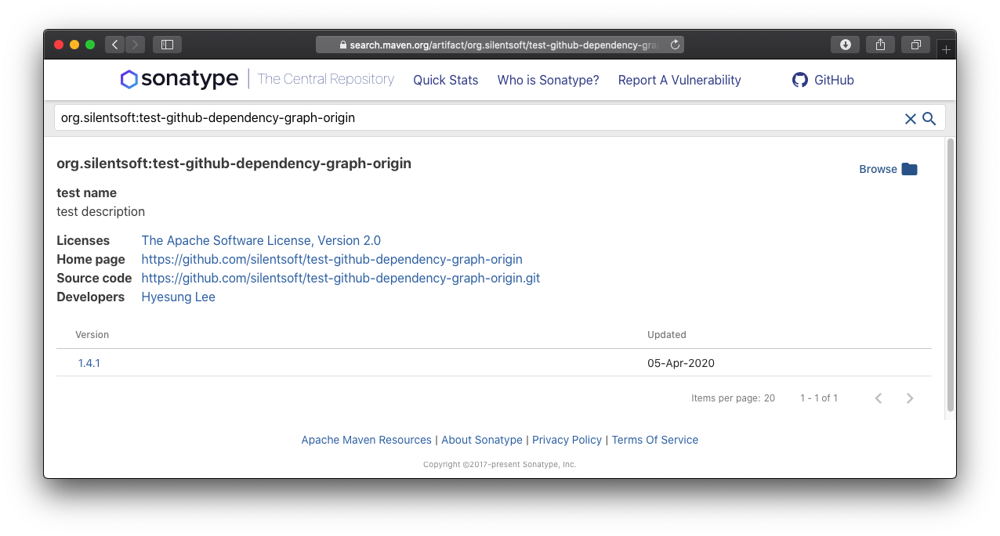

Maven 중앙 저장소에 본인이 만든 Artifact를 업로드하는 것은 그리 어렵지 않다. 충분한 커피와 3시간의 여유만 있다면 말이다.
업로드하는 과정은 크게 3단계로, `JIRA Ticket 생성`, `업로드하기`, `기다리기`로 구분된다.  

> 시작하기에 앞서 본 포스팅은 [Sonatype 공식 홈페이지](https://central.sonatype.org/pages/ossrh-guide.html)를 참고하였으며, `macOS Catalina`로 진행하였음을 밝힌다.

## 첫 번째 Step

  1. [JIRA 회원 가입](https://issues.sonatype.org/secure/Signup!default.jspa)
  2. [JIRA Ticket 생성하기](https://issues.sonatype.org/secure/CreateIssue.jspa?issuetype=21&pid=10134)
     > Group Id, Project URL, SCM url만 작성하면 된다.
  
     `Project URL`과 `SCM url`항목을 보면 'Artifact 하나 올릴 때 마다 JIRA Ticket을 생성해야 되는건가?' 생각할 수도 있지만, 그렇지 않다.
      
     JIRA Ticket은 `Group Id`별로 하나만 생성할 수 있으니, 필자가 생성한 Ticket [OSSRH-56430](https://issues.sonatype.org/browse/OSSRH-56430)처럼 GitHub 계정 주소를 남겨도 무방하다.
     
     
      
     본문을 비워두면 관리자가 댓글로 `Group Id`에 해당하는 도메인 소유 인증(필자는 `org.silentsoft`)을 어떻게 할 것인지 가이드라인을 제시하는 듯 하고,
     도메인 소유 인증 방법에는 `TXT record 인증`, `도메인 redirect 인증`, `GitHub repo 인증` 이렇게 세 가지 방법이 있는 듯 하다.
      
     도메인 소유자라면 제시한 가이드라인 중 가장 쉽고 빠르게 인증할 수 있는 방법이 `TXT record 인증`이다.
     도메인을 등록했던 사이트에 로그인한 뒤, TXT record 값에 JIRA Ticket을 명시하면 된다. (필자의 경우 `OSSRH-56430`)
      
     ```
     $ dig -t txt silentsoft.org
     
     ; <<>> DiG 9.10.6 <<>> -t txt silentsoft.org
     ;; global options: +cmd
     ;; Got answer:
     ;; ->>HEADER<<- opcode: QUERY, status: NOERROR, id: 36368
     ;; flags: qr rd ra; QUERY: 1, ANSWER: 2, AUTHORITY: 4, ADDITIONAL: 4
     
     ;; OPT PSEUDOSECTION:
     ; EDNS: version: 0, flags:; udp: 4096
     ;; QUESTION SECTION:
     ;silentsoft.org.			IN	TXT
     
     ;; ANSWER SECTION:
     silentsoft.org.		300	IN	TXT	"OSSRH-56430"
     ```
     
     `dig -t txt silentsoft.org` 명령어를 통해 위와 같이 작성했던 Ticket 값이 나오는 것을 확인했다면 관리자의 응답을 기다리면 된다.
     상황에 따라 다르겠지만, 필자는 한국 시간 일요일 오후에 Ticket을 생성했는데 7분만에 댓글이 달리고 `Resolved` 상태로 바꼈다.
     (이정도면 사람이 아니라 bot이 하는건가...)

## 두 번째 Step
> 중앙 저장소로 동기화 되기 위한 요구사항을 준수하고 업로드하기

  1. Metadata (pom.xml)
     - `name` : 프로젝트의 이름
     - `description` : 프로젝트에 대한 설명
     - `url` : 홈페이지 또는 GitHub 주소
     - `scm`
       - Sonatype 문서에는 `connection`, `developerConnection`, `url` 다 적도록 유도하는데, `url`만 적어도 문제는 없는 듯 하다. (모든 항목이 강제되는 것은 아닌 듯)        
     - `license`
     - `developer`
  2. Javadoc and Sources
     - build할 때 `javadoc`과 `source`가 포함되도록 `maven-javadoc-plugin`과 `maven-source-plugin`를 추가하자.
       ```
       <build>
         <plugins>
           <plugin>
             <groupId>org.apache.maven.plugins</groupId>
             <artifactId>maven-javadoc-plugin</artifactId>
             <version>3.2.0</version>
             <executions>
               <execution>
                 <id>attach-javadocs</id>
                 <goals>
                   <goal>jar</goal>
                 </goals>
               </execution>
             </executions>
           </plugin>
           <plugin>
             <groupId>org.apache.maven.plugins</groupId>
             <artifactId>maven-source-plugin</artifactId>
             <version>3.2.0</version>
             <executions>
               <execution>
                 <id>attach-sources</id>
                 <phase>verify</phase>
                 <goals>
                   <goal>jar-no-fork</goal>
                 </goals>
               </execution>
             </executions>
           </plugin>
         </plugins>
       </build>
       ```
  3. Sign with GPG/PGP
     - 아래를 참고하여 GPG/PGP 키를 생성하고 `keys.openpgp.org`에 전송하자. 
       ```
       $ brew install gpg
       $ gpg --gen-key
       $ gpg --list-keys
         /Users/silentsoft/.gnupg/pubring.kbx
         ------------------------------------
         pub   rsa2048 2020-04-05 [SC] [expires: 2030-04-03]
               ABCDEFG123456
         uid           [ultimate] Hyesung Lee <hyesung.lee@silentsoft.org>
         sub   rsa2048 2020-04-05 [E] [expires: 2030-04-03]
       $ gpg2 --keyserver keys.openpgp.org --send-keys ABCDEFG123456
       ```
     - build할 때 sign되도록 `maven-gpg-plugin`을 추가하자.
       ```
       <build>
         <plugins>
           <plugin>
             <groupId>org.apache.maven.plugins</groupId>
             <artifactId>maven-gpg-plugin</artifactId>
             <version>1.6</version>
             <executions>
               <execution>
                 <id>sign-artifacts</id>
                 <phase>verify</phase>
                 <goals>
                   <goal>sign</goal>
                 </goals>
                 <configuration>
                   <gpgArguments>
                     <arg>--pinentry-mode</arg>
                     <arg>loopback</arg>
                   </gpgArguments>
                 </configuration>
               </execution>
             </executions>
           </plugin>
         </plugins>
       </build>
       ```
  4. Distribution management
     - `mvn deploy`를 통해 sonatype에 배포되도록 sonatype에서 제공하는 `nexus-staging-maven-plugin`과 SNAPSHOT 배포를 위한 `snapshotRepository`를 추가하자.
       ```
           ...
           <plugin>
             <groupId>org.sonatype.plugins</groupId>
             <artifactId>nexus-staging-maven-plugin</artifactId>
             <version>1.6.8</version>
             <extensions>true</extensions>
             <configuration>
               <serverId>ossrh</serverId>
               <nexusUrl>https://oss.sonatype.org/</nexusUrl>
               <autoReleaseAfterClose>true</autoReleaseAfterClose>
             </configuration>
           </plugin>
         </plugins>
       </build>
       
       <distributionManagement>
         <snapshotRepository>
           <id>ossrh</id>
           <url>https://oss.sonatype.org/content/repositories/snapshots</url>
         </snapshotRepository>
       </distributionManagement>
       ```       
  5. `.m2/settings.xml`
     ```
     <settings>
       <servers>
         <server>
           <id>ossrh</id>
           <username>##sonatype username##</username>
           <password>##sonatype password##</password>
         </server>
       </servers>
       <profiles>
         <profile>
           <id>ossrh</id>
           <activation>
             <activeByDefault>true</activeByDefault>
           </activation>
           <properties>
             <gpg.executable>/usr/local/bin/gpg</gpg.executable>
             <gpg.passphrase>##gpg key 생성할 때 입력했던 passphrase##</gpg.passphrase>
           </properties>
         </profile>
       </profiles>
     </settings>
     ```
  6. 배포하기
     ```
     $ mvn deploy
     ```

## 세 번째 Step

  - 여기까지 왔으면 이제 sonatype에 배포한 본인의 Artifact가 중앙 저장소로 동기화 되도록 기다리는 일만 남았다.
  
    sonatype 저장소에는 10분 미만으로 배포되며, 중앙 저장소에는 2시간 정도가 소요된다. 모든것이 완료되면 [search.maven.org]()에서 확인할 수 있다.
    
    

## 번외 - 했었던 삽질

  1. `mac` 터미널에서는 `gpg ...` 명령어 수행이 잘 되는데, 이클립스에서 `maven-gpg-plugin`을 수행할 때 `gpg` 프로그램을 찾을 수 없다는 에러 발생.
     > `.m2/settings.xml`에 `gpg.executable` 속성을 `gpg`에서 `/usr/local/bin/gpg` 절대 경로로 설정하니까 잘 되더라 (...)

  2. gpg signing을 수행할 때 siging failure로 BUILD FAILURE 발생.
     > 구글링한 결과 sonatype 문서에는 없는, 아래의 plugin configuration(`--pinentry-mode`, `loopback`)으로 해결.

     ```
                 ...
                 <configuration>
                   <gpgArguments>
                     <arg>--pinentry-mode</arg>
                     <arg>loopback</arg>
                   </gpgArguments>
                 </configuration>
               </execution>
             </executions>
           </plugin>
         </plugins>
       </build>
     ```

  3. `mvn deploy`를 통해 sonatype에 업로드할 때
     - 401 Unauthorized 에러 발생.
       > `.m2/settings.xml`에 명시한 비밀번호가 웹 브라우저로 https://oss.sonatype.org/ 로그인이 되는걸보면, 일부 특수문자 때문에 안되는 듯 해서
         access token을 발급받고 `settings.xml`에 token으로 시도하니까 잘 되더라 (...)

     - gpg key server에서 key receive/verification FAILURE 발생.
       > sonatype 문서에 명시되어있던 `pool.sks-keyservers.net`가 내가 시도할 때 장애가 있었던 건지, 응답이 없어서 key가 올라가질 않아 발생했던 문제.
         `keys.openpgp.org`로 변경하여 key send 후 재시도하니까 잘 되더라 (...)

---    

참고
  - https://central.sonatype.org/pages/ossrh-guide.html
  - https://stackoverflow.com/questions/53992950/maven-gpg-plugin-failing-with-inappropriate-ioctl-for-device-when-running-unde