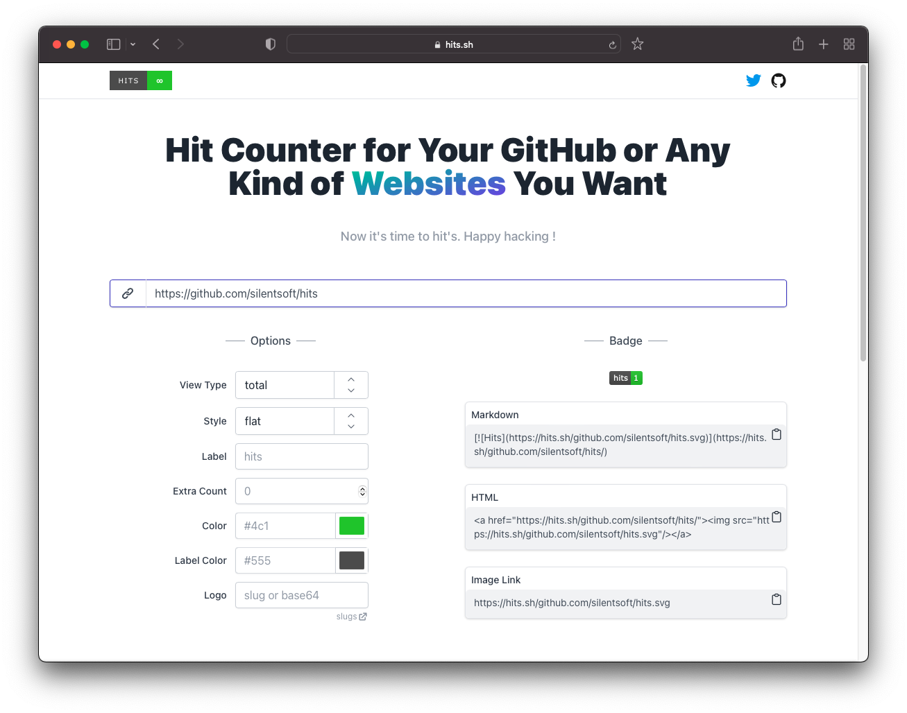

GitHub 프로필이나 레파지토리, 블로그 등을 방문하다 보면 이 블로그의 왼쪽처럼 방문자 카운터가 달린 것을 종종 볼 수 있다.

방문자 카운터를 제공하는 서비스는 여러 개가 있다. 필자는 [Hits.sh](https://hits.sh)를 사용했다.

도메인이 `.sh` 도메인이라서 그런지 UI 컨셉이 터미널이다.

이 터미널(?)에 방문자 카운터를 적용할 url을 입력하면 markdown 태그와 html 이미지 태그를 만들어준다.
이 태그를 GitHub이나 블로그의 적절한 위치에 적용하면 된다.

hits.sh 서비스는 여러 가지 커스터마이징 옵션을 제공하는데, 카운트를 `total`로 보여줄지 `today-total`로 보여줄지 선택할 수 있고,
배지의 스타일을 `flat` 또는 `flat-square` 등으로 설정할 수 있다. 이외에도 로고 및 색상 역시 커스터마이징 옵션으로 제공한다.

hits.sh는 특히 카운트 마이그레이션 기능을 제공하는데,
이 글을 읽는 독자 본인이 사용하던 방문자 카운터 서비스가 End of Service를 했다던가(..) 알 수 없는 이유로 더 이상 서비스하지 않는다면 그 수만큼 더해서 표시하는 기능(`--extra-count`)도 제공한다.

사실 hits.sh 서비스의 탄생 배경에는 슬픈 이야기가 있다. 앞서 얘기했던 End of Service가 필자의 이야기이기 때문이다. (..)

몇 년 동안 사용했던 방문자 카운터 서비스가 문을 닫아서 다른 서비스로 넘어가려 했지만, 마이그레이션 기능을 제공하는 서비스가 없어서 그냥 내가 만들었다.

GitHub - [https://github.com/silentsoft/hits](https://github.com/silentsoft/hits)

~~사용하게 된다면 GitHub Star 한 번만..~~

