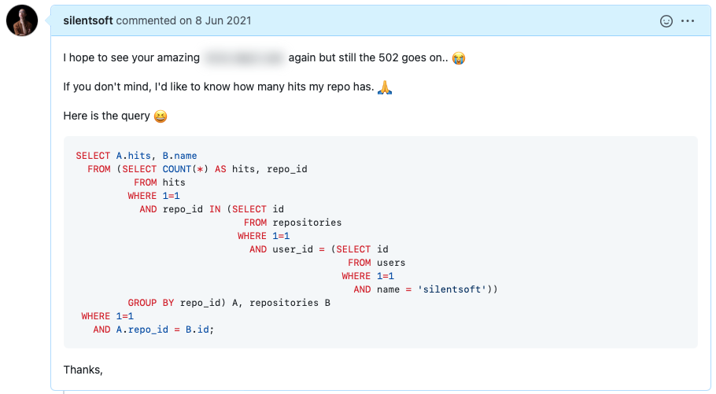
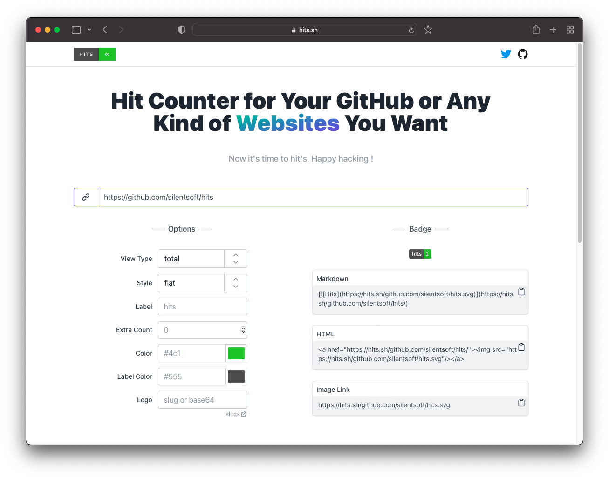
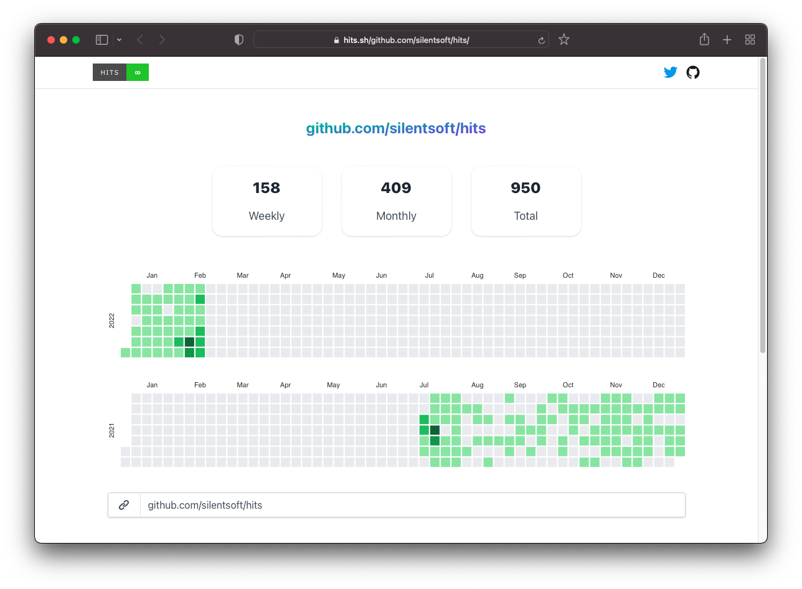
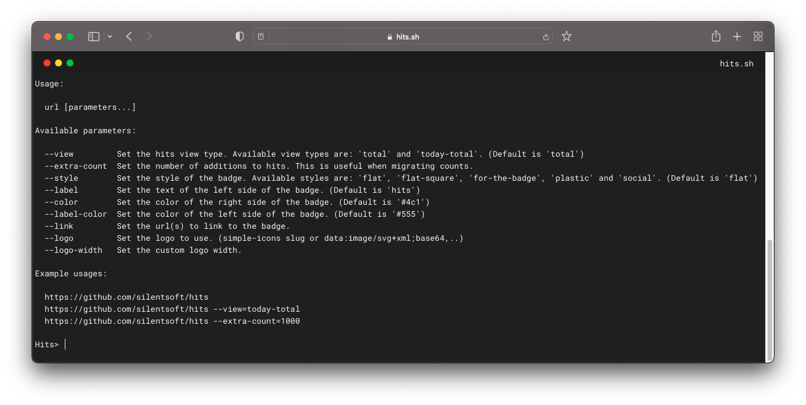

작년 초에 내가 사용하던 방문자 카운터가 갑자기 사라졌다. 처음엔 엑박이 뜨길래 '이러다 다시 되겠지'라고 생각했지만 몇 주 동안 엑박은 해결되지 않았다.
그동안 쌓은 방문자 카운트가 사라지는 건 아닐까 하는 두려운 마음에 상황을 알리기 위해 이슈를 등록하려고 깃허브에 들어갔다.
하지만 이미 이슈는 등록되어 있었다. 메인테이너는 원인을 찾는 중이라고 댓글을 달았지만 몇 달이 지나도록 엑박은 해결되지 않았다.

혹시 몰라서 내가 사용하고 있는 url 카운트라도 좀 알려달라고 따로 이슈를 올렸다.

이때 어느 정도 예상은 했다.
소스 코드때문에 동작하지 않는 거라면 최근 커밋을 롤백했을테고,
백엔드 앞 단에서 라우팅에 문제가 있었다면 벌써 해결되었을 문제인데
지금까지 해결되지 않는 것을 보아하니 디비를 날려 먹었겠구나...

나는 결국 포기하고 다른 방문자 카운터 서비스로 넘어가기 위해 여러 서비스를 둘러보기 시작했다.
그런데 다들 나 같은 상황에 빠진 유저 시나리오는 생각하지 못했던 건지, 카운트 마이그레이션을 제공하는 서비스는 찾지 못했다.

그래서 그냥 내가 만들었다.

사이트 - [https://hits.sh](https://hits.sh)

처음에 만들 당시에는 도메인이 `.sh`라서 터미널 컨셉으로 만들었었는데, 반응이 뜨뜻미지근해서 최근에 Tailwind CSS를 사용해서 리브랜딩했다.
그래도 터미널을 버리면 닉값(?)을 못하는 것 같아서 데스크톱으로 접속했을 때 아래쪽에 터미널이 나오도록 숨겨놨다.

공교롭게도 UI를 한참 리브랜딩하고 있을 때 내가 등록한 깃허브 이슈에 댓글이 달렸다.

초기화된 데이터를 알려줘서 좀 아쉽긴 하지만... 어쨌든 작년에 등록한 이슈인데도 무시하지 않고 지금이라도 댓글을 달아줘서 감사하다.

블로그 글을 쓰고나서 깨달은 건데, 글을 쓰다 보면 **"나는 어쩌다 방문자 카운터 서비스를 만들게 되었나"**에 대한 장황한 서사와 이유가 나올 줄 알았는데,
**"내가 원하는 기능을 제공하는 서비스가 없어서 만들었다."** 그 이상 덧붙일 말이 없어서 끝을 어떻게 맺어야 할지 모르겠다.

내가 만든 서비스가 마음에 들었다면 깃허브 스타 한 번 부탁드린다.

깃허브 - [https://github.com/silentsoft/hits](https://github.com/silentsoft/hits)